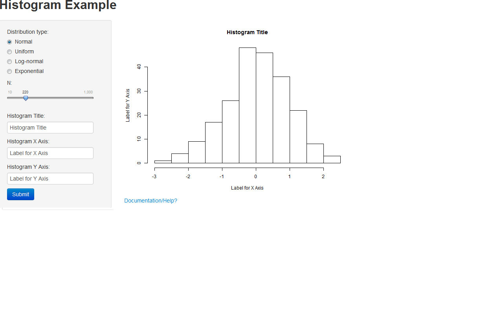

## Introduction

<ol>
  <li>This is my reproducible pitch as part of Coursera Developing Data Products.</li>
  <li>The presentation briefly speaks about the Shiny app that was developed as part of Project Assignment.</li>
  <li>The application under discussion is available at shiny app, <a href="https://srini459.shinyapps.io/Assignment/" target="_blank">Select Distribution</a></li>
</ol>


---

## Input Screen 

<b>Below image shows the overall layout of the application with input screen</b>



---

## How it works

<ol>
  <li>User is given a provision to select the distribution type.</li>
  <li>User is given a provision to select the number of observations.</li>
  <li>User is given a provision to select histogram title, labels for x-axis and y-axis.</li>
  <li>Submit button should be clicked so that user choice is applied and a histogram is generated.</li>
  <li>An in-line help is provided.</li>
</ol>


---

## Sample Graph

```{r message=FALSE,warning=FALSE,echo=TRUE,fig.width=8, fig.height=5}

    hist(rnorm(n=1000),main="My Title",xlab="X-Axis Label",ylab="Y-Axis Label")

```
---
